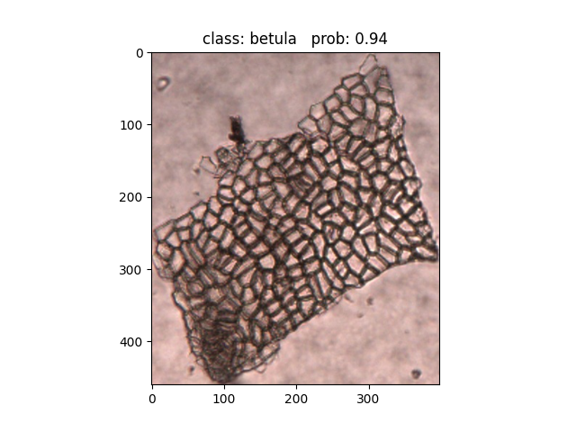

# 代码使用说明
本研究提出了针对食草动物粪便中残留的植物表皮细胞的神经网络识别方法，用于辅助实验人员进行粪便显微分析。
>实验中使用了包含6个种类的1473张表皮细胞图像对模型进行训练和测试，识别准确率达到86.46%。
## 准备阶段
使用到的pytorch和timm版本如下：
* PyTorch 1.13.0
  >pip3 install torch==1.13.0 torchvision torchaudio --extra-index-url https://download.pytorch.org/whl/cu116
* timm 0.6.11
  > pip install timm=0.6.11 
## 训练阶段
1. 将数据集中相同类别的图片放置于同一子文件夹下
2. 在`tran.py`脚本中将`--data-path`设置为数据集的绝对路径；
   将`--num_classes`设置为数据集类别数；`--epochs`设置为训练周期
3. 运行`train.py`脚本，生成`class_indices.json`是训练数据集对应的标签文件；`weights`文件夹下存储训练后的权重文件

## 预测阶段
1. 在`predict.py`中导入模型
2. 将`predict.py`脚本中`img_path`设置为需要预测的图片的绝对路径；
   `model_weight_path`设置为训练好的模型权重路径；`num_classes`与训练时设置的类别数相同
3. 运行`predict.py`脚本进行预测

>预测结果示例图

